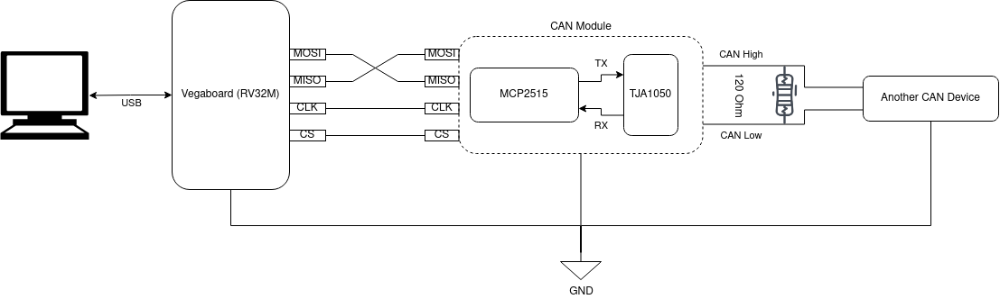

# Open CAN Sniffer

The aim of this project is to make a prototype of a open-hardware/software CAN Bus to USB Sniffer for Linux/Windows-based machines. The CAN communication goes through a MCP 2515 controller which is connected to a RI5CY processor. The processor hosts a FreeRTOS kernel which provides a Virtual COM on the end-user machine as shown below:

 There is no dynamic (heap) allocation at the application layer, but still there are heap allocations at the official middleware/driver layer due to using dynamic semaphores. A [polling mechanism](https://github.com/langroodi/CANBus/blob/9dc0e62f9f06ad22f80662cdaff537a0e7cf9b08/ri5cy/riscveclipse/spi_helper.h#L52) is designed for almost efficient data fetching from the SPI (not as efficient as the [DMA mechanism](https://mcuxpresso.nxp.com/api_doc/dev/116/group__spi__dma__driver.html)), but due to lack of succifient stability the usage has been ignored in the final version.

## Dependecies
The dependencies of the project in hardware and software categories are as follows:

### Hardware dependecies
- [RV32M1 VEGAboard](https://open-isa.org) (runs only on PULP RI5CY RISC-V core)
- [MCP2515](https://www.microchip.com/en-us/product/mcp2515) (Stand-Alone CAN Controller with SPI Interface)
- [SEGGER J-Link EDU Mini](https://www.segger.com/products/debug-probes/j-link/models/j-link-edu-mini) (for JTAG programming and HIL debugging)

### Software dependecies
- C Standard: 99
- Cmake mimimum version: 2.6
- Compiler: [GCC RISC-V Embedded 7.1.1](https://github.com/pulp-platform/pulp-riscv-gnu-toolchain)
- FreeRTOS kernel: 9.0.0
- [RV32M1 SDK](https://github.com/pulp-platform/pulp-riscv-gnu-toolchain): 1.0.0
- [OpenOCD](https://openocd.org): 0.10.0 (only for debugging)

## Steps to run the project
1. Connect the **MCP2515** module to the **VEGAboard** `SPI0` pins (i.e., J2 pin 6, 8, 10, and 12) with a common ground;
2. Connect the other CAN device to the **MCP2515** module with a common ground while setting the bus speed to _5 kbps_;
3. Set the `RISCV32SDK_DIR` environment variable to the path where the **RV32M1 SDK** has been installed;
4. Use the mentioned RISC-V Toolchain to compile the firmware;
5. Flash the compiled firmware (`open_can_sniffer.elf`) to the **VEGAboard** using the JTAG programmer;
6. Connect the **VEGAboard** USB port to the PC;
7. Connect the **VEGAboard** OpenSDA port to the PC to see the debugging logs (optional);
8. Power up the **MCP2515** module and the **VEGAboard**;
9. Use the in-house [USBCAN-GUI](https://github.com/langroodi/USBCAN-GUI) software on the PC to see the received CAN packets;
10. Use a 3rd-party serial port terminal (e.g., [Putty](https://www.putty.org)) on the PC to connect to the OpenSDA COM port for monitoring the logs (optional).
